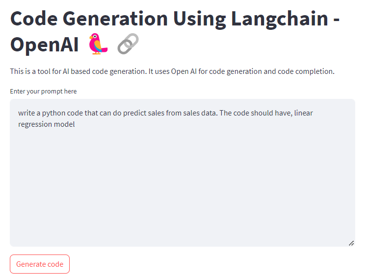
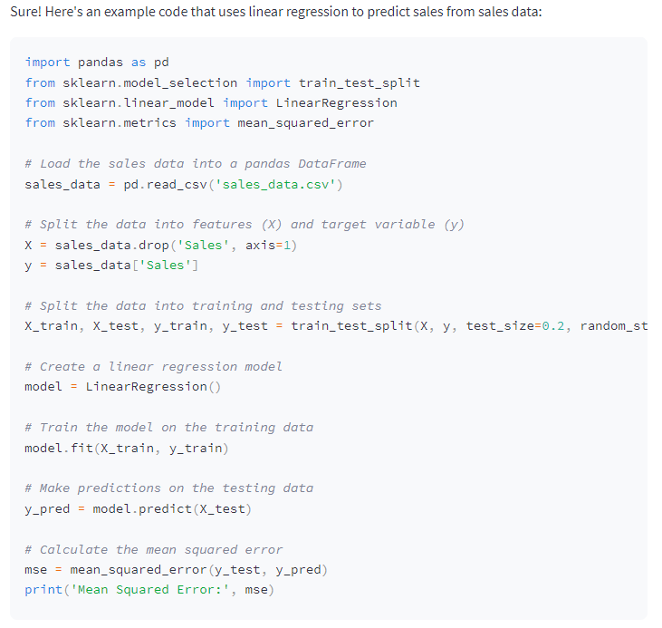

## Simple Code Generation using Langchain, Streamlit, and Open AI


### Project Overview
This project offers a user-friendly implementation of code generation, harnessing the capabilities of Streamlit, OpenAI, and LangChain. The application empowers users to effortlessly generate code snippets by providing natural language input.

The code generation process involves leveraging the state-of-the-art language model provided by OpenAI to interpret natural language input. The interpreted text is then passed through LangChain, a specialized language model tailored for code generation. The resulting code snippets are presented to the user through an interactive and intuitive interface built with Streamlit.

The app is intended to generate required code and suitable for a variety of coding tasks, such as:

* writing functions
* writing classes
* web-apges
* unit tests
* docstrings
* code translations, and many more use-cases.

### Tech Stack
* [**Streamlit**](https://streamlit.io/): A web app framework for Python.
* [**Langchain**](https://python.langchain.com/docs/integrations/chat/openai): A framework for developing applications powered by language models
* [**Open AI**](https://platform.openai.com/docs/overview): The powerful language model employed for natural language understanding and code generation.

### Key Features
1. Natural Language Input: Users can input code requirements using plain language, making it accessible to both developers and non-developers.

2. Streamlit Interface: The application is built on the Streamlit framework, offering a clean and responsive web-based interface. Streamlit's simplicity allows for quick iteration and easy deployment.

3. OpenAI Integration: Harnessing the power of OpenAI's language models ensures robust and accurate natural language understanding, laying the foundation for precise code generation.

4. LangChain Specialization: LangChain enhances the code generation process by providing a specialized language model optimized for translating natural language into code.

**Screenshot 1**: _Input the prompt_



### Installation
Follow the steps below to set up and run the code generation app:

#### 1. Clone the Repository

```bash
git clone https://github.com/ridwanspace/code-generation-streamlit.git
cd code-generation-streamlit
```

#### 2. Install Dependencies
```bash
pip install -r requirements.txt
```

#### 3. Create `env` file and pass OpenAI Key
```bash
OPENAI_KEY = xxxx
```

#### 3. Run the App
```bash
streamlit run app.py
```

**Screenshot 2**: _Generated code_




### Cost
Check this [pricing](https://openai.com/pricing) in Open AI

