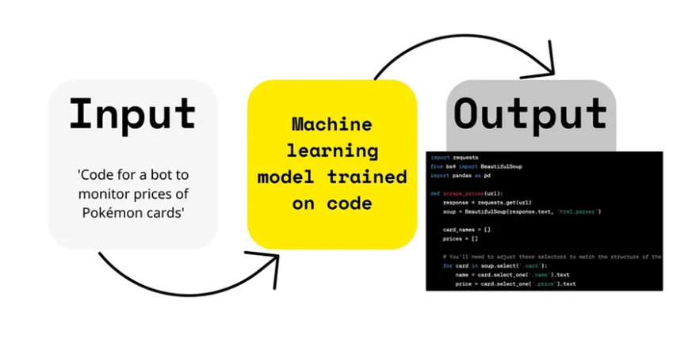
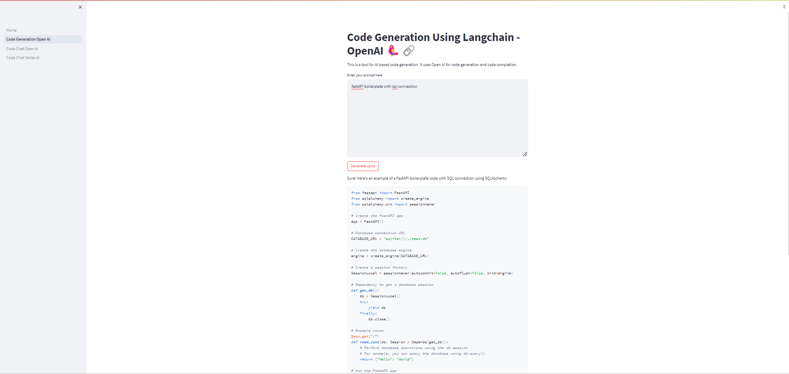
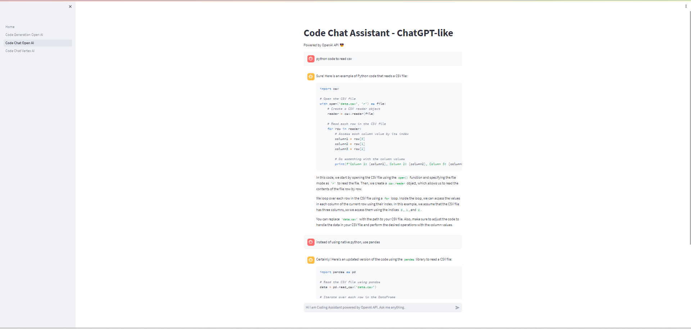
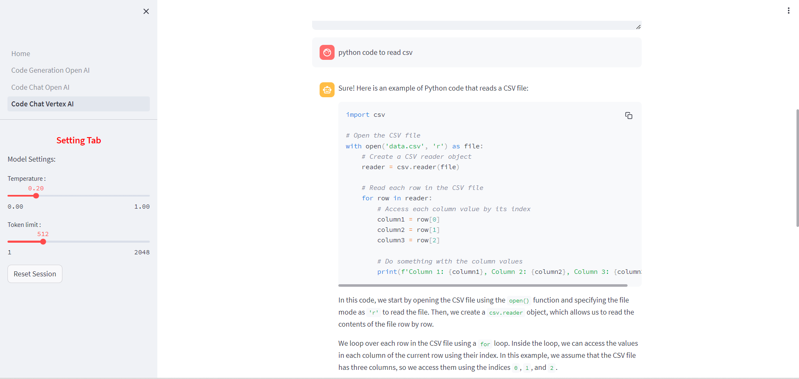
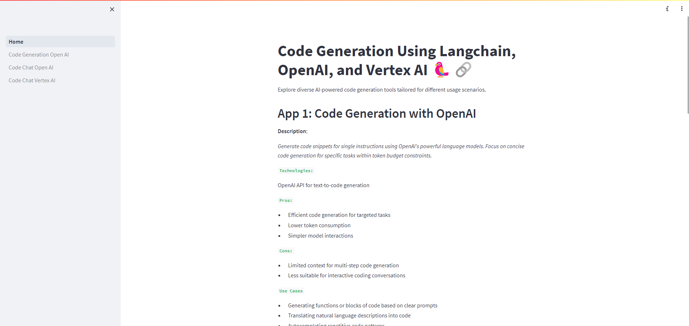

## Code Generation Powered by Langchain, OpenAI, and Vertex AI 



### Project Overview
This Streamlit project offers three distinct pages, each showcasing a unique approach to AI-assisted code generation:

1. Code Generation with OpenAI

**Screenshot 1**: _App 1_


2. Chat Assistant for Coding with OpenAI Chat GPT 3.5 Turbo

**Screenshot 2**: _App 2_


3. Chat Assistant for Coding with Vertex AI's Code Chat Model

**Screenshot 3**: _App 3_


The code generation process involves leveraging the state-of-the-art language model provided by OpenAI to interpret natural language input. The interpreted text is then passed through LangChain, a specialized language model tailored for code generation. The resulting code snippets are presented to the user through an interactive and intuitive interface built with Streamlit.

The app is intended to generate required code and suitable for a variety of coding tasks, such as:

* writing functions
* writing classes
* web-apges
* unit tests
* docstrings
* code translations
* and many more use-cases.

### Tech Stack
* [**Streamlit**](https://streamlit.io/): A web app framework for Python.
* [**Langchain**](https://python.langchain.com/docs/integrations/chat/openai): A framework for developing applications powered by language models
* [**Open AI**](https://platform.openai.com/docs/overview): The powerful language model employed for natural language understanding and code generation.
* [**Vertex AI**](https://cloud.google.com/vertex-ai/?hl=en): A unified AI platform by Google Cloud.

### Key Features
1. Multiple AI Models: Experiment with different AI models for code generation, each with its own strengths and applications.
2. Interactive Interface: Engage with the models through a user-friendly Streamlit interface.
3. Clear Explanations: Understand the pros, cons, and use cases of each approach.

**Screenshot**: _Main Page_



### Installation
Follow the steps below to set up and run the code generation app:

#### 1. Clone the Repository

```bash
git clone https://github.com/ridwanspace/code-generation-streamlit.git
cd code-generation-streamlit
```

#### 2. Install Dependencies
```bash
pip install -r requirements.txt
```

#### 3. Put Google Cloud Project's Service Account (JSON) into root folder

#### 4. Create `env` file and pass OpenAI Key and Service Account (GCP) file path + GCP Project ID
```bash
OPENAI_KEY = xxxx
VERTEXAI_SA = xxx.json
PROJECT_ID = xxxx
```

#### 5. Run the App
```bash
streamlit run app.py
```


### Cost
- Check this Open AI[pricing](https://openai.com/pricing)
- Check this Vertex AI[pricing(https://cloud.google.com/vertex-ai/pricing)]


